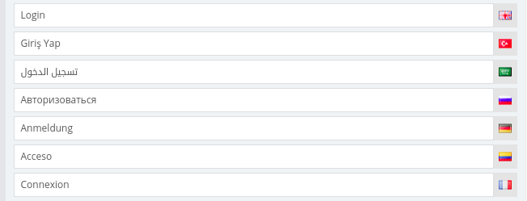

# journal-theme-language-translate

- This is a tool that facilitates your language translations.
- This is an example. You can develop it according to your needs.
- This example has been tested by opencart admin.

## Requirements

https://github.com/Stichoza/google-translate-php

### Add to the bottom of the page
```HTML
<script src="view/javascript/translate.js" type="text/javascript"></script>
```

### Start a service on your local server

```shell
sudo php --server localhost:8080 --docroot  .
```

or

Xampp,Wampp etc.

### If you double click on the first input, it will automatically fill in the others.


